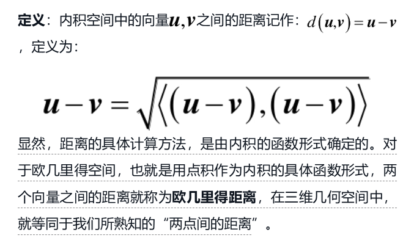
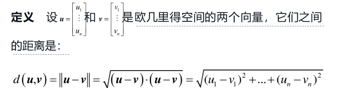
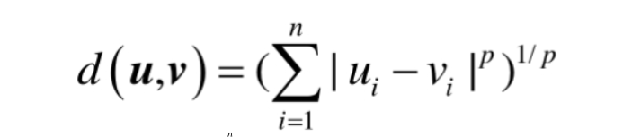
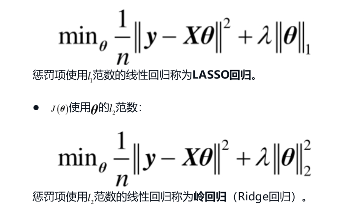

## 第一章 向量和向量空间

线性代数的入门概念：向量和向量空间。

直觉的向量：有向线段，大小，方向，运算：头尾相接和逆向。

直觉的向量空间：直线，平面。

由数轴引出，笛卡尔系中研究向量：

1. 原点和坐标轴：向量空间中需要原点作为参照系，所有有向线段以原点作为起点。这样**终点的坐标可以指代唯一的向量**。
2. 方向：向量和哥哥坐标轴的夹角。
3. 大小：根据坐标和平方根公式计算。
4. 运算：加法（坐标对应位置相加）和数乘（坐标分别与数字相乘）。
5. 向量空间：不同维度的笛卡尔系。

由一维的直觉感知，实现对概念在高纬情况的抽象理解。

抓住事物或行为的基本和主要的特点。

### 1.1 向量

艾萨克牛顿在自然哲学的数学原理中，将力概念化为向量。后人在此基础上正式定义了向量。

#### 1.1.1 描述向量

- （向量的定义）向量是既有大小又有方向的量。   

  - （向量物理量）常见于物理量，比如力，速度，加速度，角速度，动量。满足矢量运算法则（平行四边形法则）。

  - （标量物理量）标量有温度，面积，质量等，区别在于是否描述了一个有空间方向性的量。

  - （标量正负是否代表方向）有些标量也有正负表示，单并不代表起有方向。标量的正负是标量值域内某一基准而生成的，不定义空间中的方向。

- （向量的一般表示）用直角坐标系定义空间，用点的坐标表示直角坐标系上由原点作为起点的向量。

  - （有向线段）直觉上，用平面上画有向线段来表示一个向量。不在坐标系中能画出多个相同的向量。
  - （点的坐标）进一步，除了几何线段外，**平面直角坐标系**中**点的坐标**准确表示一个从原点到该点的向量，可以准确计算其大小和方向。书面中用方括号将终点坐标括起来表示向量。根据排列方向有行向量和列向量。
  - （序列的长度代表维度）序列的长度代表向量在几维空间中。计算机中有ndarray数组，tensor张量，计算速度比列表快。

- （机器学习为什么使用向量）通过向量将世界中的对象（文本、图像、人）抽象为模型可以处理的形式，是机器学习得以实现的“桥梁”

  - tf-idf将所有文本向量化。

    - 1.建立词库：统计所有句子中出现的词，词库的大小作为向量的维度。

    - 2.计算每个句子中所有词的词频，词频是一个词在某句中出现的次数比上该句的总词数。词频越大，对该句越重要。

    - 3.计算每个句子中所有词的逆文档频率（idf）,逆文档频率是包含该词的句子数与句子总数比值的倒数。通常对其分母加一，且对数包裹以防线性增长。
    - 4.idf作为权重与tf相乘可以很好地描述一个词作为句子的特征。

#### 1.1.2 向量的加法

- （加法几何意义）几何上，向量的加法即平行四边形法则，两向量头尾相连所到达的点，由该点的坐标表示计算出的向量。
- （数值计算）数值上是向量坐标对应位置相加，本质上是正交法，坐标的数值是向量在坐标轴上的投影。

#### 1.1.3 向量的数量乘法

- （乘法几何意义）几何上，向量乘上一个实数代表反向和延申操作。

- （数值计算）数值上是该数与序列的每个数字做乘法。

### 1.2 向量空间

空间中指定了一些规则。空间的元素遵循规则。

在二维空间中，两个向量相加或数乘后的结果仍然在这个平面中。而叉积的计算结果垂直于平面，不属于这个空间。

#### 1.2.1 向量空间

【1. 基本定义】（对加法和数乘封闭且满足八个公理）

设 F 是一个域（比如常见的实数域 R 或复数域 C），V 是一个非空集合。若集合 V 上定义了两种运算：
  （a）向量加法：对任意 u, v ∈ V，有 u + v 仍在 V 中；
  （b）标量乘法：对任意 a ∈ F 与任意 v ∈ V，有 a·v 仍在 V 中；

如果这两个运算满足下面八条公理（也称为向量空间公理），则称 V 是一个定义在域 F 上的线性空间：

【A. 加法运算的公理】封闭，交换，结合，**零向量，负向量**

  1. 加法封闭性：对任意 u, v ∈ V，有 u + v ∈ V。

  2. 交换律：对任意 u, v ∈ V，有 u + v = v + u。

  3. 结合律：对任意 u, v, w ∈ V，有 (u + v) + w = u + (v + w)。

  4. 存在零向量：存在一个零向量 0 ∈ V，使得对任意 v ∈ V，有 v + 0 = v。

  5. 存在负向量：对任意 v ∈ V，存在一个向量 –v ∈ V，使得 v + (–v) = 0。

【B. 标量乘法运算的公理】封闭，结合，2分配，单位元1

  6. 乘法封闭性：对任意 a ∈ F 与任意 v ∈ V，有 a·v ∈ V。

  7. 分配律（关于向量加法）：对任意 a ∈ F 与任意 u, v ∈ V，有 a·(u + v) = a·u + a·v。

  8. 分配律（关于域中的加法）：对任意 a, b ∈ F 与任意 v ∈ V，有 (a + b)·v = a·v + b·v。

  9. 结合律：对任意 a, b ∈ F 与任意 v ∈ V，有 a·(b·v) = (a·b)·v。

  10. 单位元：存在 F 的乘法单位元 1，使得对任意 v ∈ V，有 1·v = v。

【2. 直观理解】

可以把线性空间（向量空间）看作一个“载体”，其中的元素叫做向量，这些向量可以相加，也可以被标量（来自 F）相乘。向量加法和标量乘法必须满足上面列出的性质，因此我们可以利用这些运算对向量进行“线性组合”。从而很多关于线性组合、线性相关、基与维数的讨论都建立在线性空间的这一基本结构之上。

【3. 常见例子】

① Rⁿ：最常见的例子就是实数域上所有的 n 维向量。例如，R² 表示平面上的所有向量，R³ 表示空间中的所有向量。

② 多项式空间：设 Pₙ 表示所有次数不超过 n 的多项式构成的集合。对于任意两个多项式 p(x) 和 q(x) 及任意标量 a，(p+q)(x) 和 a·p(x) 仍然是次数不超过 n 的多项式，所以 Pₙ 是一个 R-线性空间。

③ 函数空间：设 V 为某个区间上所有连续函数构成的集合。对于两个连续函数 f 和 g 以及任意常数 a, b，af(x) + bg(x) 仍然是连续函数，从而这个集合构成一个 R-线性空间。

④ 矩阵空间：例如所有 m×n 的矩阵构成的集合，加法和标量乘法的定义与向量空间中的类似，所以它们也构成一个线性空间。

【4. 线性空间的重要性】

线性空间构成了线性代数的基础。很多重要概念和定理（如基、维数、线性变换、特征值与特征向量、主成分分析等）都建立在线性空间的框架上。线性空间不仅在数学理论中有着重要位置，而且在物理、工程、经济等许多实际问题中都有广泛应用。总之，线性空间用一个简单而强大的结构框架帮助我们研究各种对象之间的线性关系，为理解和解决许多数学及应用问题提供了基础工具。

- 若数域F上线性空间V的元素为向量，则线性空间称作向量空间。
- **向量空间**是一个满足线性空间规则的向量集合。最大特点是满足对加法和数乘的封闭性。似乎因为**封闭性质**有一种**完备**和**无穷**的感觉，向量的集合称作空间。
- 我们熟悉的二维平面空间，三维立体空间是实数域R上的一个向量空间。

#### 1.2.2 线性组合

**向量空间中的一个向量组和实数域中的一个系数组组成。向量组和权重的组合。也可以理解为，一个矩阵和列向量相乘的结果。**

线性组合是构造新向量的一种基本方法，它在研究向量之间的关系、构造向量空间的子空间以及讨论向量的线性相关性时发挥着关键作用。

【1. 线性组合的定义】

设 V 是一个定义在域 F 上的线性空间，v₁, v₂, …, vₙ 是 V 中的若干个向量。如果对每个向量 vᵢ，有对应的标量 aᵢ ∈ F，那么形式
  a₁·v₁ + a₂·v₂ + … + aₙ·vₙ
就被称为这些向量的一个线性组合。

换句话说，线性组合就是利用给定向量，通过标量乘法和向量加法得到的新向量。这里的系数 a₁, a₂, …, aₙ 可以是任意数（在 F 内），并不要求满足特殊条件（除非在特定上下文中，例如讨论凸组合时需要系数非负且和为 1）。

向量空间中的**向量组**和数域中的**系数组**可以组成线性组合，表示一个向量空间中的向量。

【2. 线性组合的直观理解】

可以把线性组合想象成“加权求和”。例如，在二维平面上，假设有两个向量 v₁ 和 v₂，那么任何位于这个平面内的向量都可以表示为这两个向量的合适加权和，也就是
  v = a₁·v₁ + a₂·v₂
前提是 v₁ 和 v₂ 不共线（即它们线性无关），才能“覆盖”整个平面。这种加权求和的方式正是线性组合的直观涵义。

【3. 线性组合与向量空间的“生成”】

当我们取一个向量组 {v₁, v₂, …, vₙ} 的所有可能线性组合时，这些所有的向量构成一个集合，称为这个向量组的“线性包”或“生成子空间（span）”，记为
  span{v₁, v₂, …, vₙ} = {a₁·v₁ + a₂·v₂ + … + aₙ·vₙ | a₁, a₂, …, aₙ ∈ F}.

这个生成的子空间是一个包含原始向量组的最小的线性子空间。若利用给定的向量组可以生成整个空间 V，则称该向量组生成了 V 或者说这组向量是 V 的一组“生成元”。

【4. 线性组合与线性无关性】

讨论线性组合时，一个非常重要的相关概念是“线性相关”和“线性无关”。
  - 如果存在一组不全为零的标量 a₁, a₂, …, aₙ，使得
    a₁·v₁ + a₂·v₂ + … + aₙ·vₙ = 0
                （零向量），则称向量组 {v₁, v₂, …, vₙ} 线性相关。
  - 若唯一能使得上述等式成立的标量组合为 a₁ = a₂ = … = aₙ = 0，则称这个向量组是线性无关的。

线性无关的向量组合为构成向量空间的基（Basis）提供了重要条件，因为基的定义要求其元素既要生成整个向量空间，又必须互相线性无关。

【5. 应用与举例】

① R² 中的例子：
  设有两个向量 v₁ = (1, 0) 和 v₂ = (0, 1)，那么任一平面上的向量 (x, y) 都可以写成
    (x, y) = x·(1, 0) + y·(0, 1)。
  这正是利用标准基通过线性组合构造任一向量的典型例子。

② 多项式空间中的例子：
  考虑集合 {1, x, x²}，它们属于次数不超过 2 的多项式空间 P₂。任意一个二次多项式 p(x)= a₀ + a₁·x + a₂·x² 都可以看作是 1, x, x² 的线性组合。

③ 函数空间中的例子：
  假设我们研究连续函数空间 C[a, b]，给定两个函数 f(x) 和 g(x)，那么任何形式的 af(x)+bg(x) 也是一个连续函数，这就构成了 f 和 g 的线性组合。

【6. 小结】

线性组合是线性代数最基础但又极其重要的概念，它不仅用于构造和描述向量空间的子结构（如生成子空间），还是定义线性相关性、线性无关性以及基等更高级概念的基础。通过理解和应用线性组合，我们能更好地分析和操作各种数学对象之间的线性关系，从而为后续的线性变换、特征向量、矩阵理论等内容打下坚实的基础。

线性方程组可以转化为线性组合与向量的关系。

#### 1.2.3 线性无关

线性无关和线性相关是向量组的性质。

- 向量组合的线性相关性
  - 几何上，共线的两个向量线性相关。向量u和v，总能写成u=kv。反之，不共线的向量线性无关。
  - 如果一个线性组合与0向量的方程组（齐次方程组）**存在非零解**，那么这个线性组合的向量组是线性相关的，相反，如果一个线性组合与0向量的方程组（齐次方程组）只有全为0的解，则线性无关。

- 推论：

  - 线性无关的向量组的任意部分都线性无关。

  - 如果向量组的任何一部分线性相关，那么向量组线性相关。

  - 含有零向量的向量组，一定线性相关。

- **具备这种性质的向量组和线性组合生成的空间维度和向量个数相同。**
  - 线性无关组能及其所有线性组合表达一个维度和向量个数相同的空间。正交的线性组实际上是坐标系。
  - n维空间也最多有n个线性无关的向量。
  - 
    二维空间中，任意线性无关的两个向量都与第三个向量线性相关。
  - n维空间有n个线性无关的向量，我们可以用这些向量表征空间中任意第n+1个向量。

在机器学习中，线性相关的特征，one-hot编码男女两列均是无效的。

#### 1.2.4 子空间

设 V 是一个定义在域 F 上的线性空间，v₁, v₂, …, vₙ 是 V 中的一个向量组。**向量组**和**数域中不同系数组**的所有线性组合形成原本向量空间的非空子集，我们称这个非空子集为原本向量空间的**子空间**。

几何意义：三维空间中，二维平面就是一个子空间。

在子空间内满足加法封闭和数乘封闭，非空集合和数乘封闭能推出集合一定拥有零向量。任意两个向量组线性组合的加法和数乘结果仍然是原向量组的线性组合，因而满足封闭。

齐次线性方程组的解都是子空间，因为满足零向量。

齐次线性方程组 Ax=0*A***x**=**0** 的解集构成一个子空间，原因在于它满足子空间的三个核心条件：**包含零向量**、**对加法封闭**、**对数乘封闭**。以下是具体分析：

###### 1. **包含零向量**

- 齐次方程组的形式为 A**x**=**0**，显然当 **x**=**0** 时等式成立。
- 因此，解集必然包含零向量，满足子空间的第一个条件。

###### 2. **对加法封闭**

- 假设 **u** 和 **v** 是方程组的两个解，即A**u**=**0** 和 A**v**=**0**。
- 将两者相加：
  *A*(**u**+**v**)=*A**u**+*A**v**=**0**+**0**=**0**
- 因此，**u**+**v** 也是解，加法封闭性成立。

###### 3. **对数乘封闭**

- 假设 **u** 是解，*k* 是任意标量，则 A**u**=**0**。
- 对数乘运算：
  *A*(*k**u**)=*k*(*A***u**)=*k***0**=**0**
- 因此，k**u** 也是解，数乘封闭性成立。

###### 对比非齐次方程组

对于非齐次方程组 A**x**=**b**（其中 b≠0），解集不包含零向量（除非 b=0），且解的和或数乘后可能不再满足原方程，因此解集不构成子空间，而是**仿射空间**。

为什么在讨论子空间时只需要满足封闭性，不用讨论线性组合十大公理的其他8个公理？

这是因为子空间 W 是从一个已知的向量空间 V 中的一个非空子集，而 V 本身已经满足向量空间的所有十条公理。也就是说，V 中的加法和标量乘法运算已经满足那些公理，所以当我们考虑 W 的运算时，它们实际上是 V 中相同的运算，在这些运算规则下，很多性质可以自动继承。

具体来说：

1. 既然 W ⊆ V，W 中的加法和标量乘法与 V 中的相同，那么加法的交换律、结合律、数乘的分配律、结合律、以及标量乘法单位元这些性质会自然地从 V 中继承给 W，无论 W 是否满足额外的封闭性条件。
2. 子空间判定的核心就是检查 W 本身是否形成一个“自洽”的结构，即检查 W 是否能在 V 的运算下“闭合”（也就是说，对于任意 u, v ∈ W，u+v ∈ W；对于任意 u ∈ W 和任意标量 c，c·u ∈ W）。这两条封闭性质确保了在 W 内进行运算时不“跑”出 W。
3. 当 W 满足这两条封闭条件时，加上非空性（通常通过证明存在零向量，或假设 W 非空后利用标量乘法闭合性得到零向量），其余所有的向量空间公理（如加法交换律、结合律等）都能从 V 中继承，因此我们不用再次逐条验证。

总结：由于 W 是 V 的子集，V 的运算规则已经预设了所有向量空间的公理，只需保证 W 对这些运算（加法和标量乘法）封闭，就能确保 W 继承这些公理，从而自身也成为一个向量空间。

### 1.3 基和维数

笛卡儿坐标系之于平面空间的创建和作用，那么更一般化的“坐标”应该如何定义？

#### 1.3.1 极大线性无关组和向量组的秩

- 向量组等价（能生成同一个空间）

  如果向量组A中的每个向量可以用向量组B中的向量以线性组合的形式表示（称为线性表出），反之，向量组B也可以由向量组A线性表出，则这两个向量组等价。

- 极大线性无关组

  定义　某向量组的一个部分组，如果满足：●　这个部分组线性无关●　从向量组的其余向量中（如果有）任取一个添加进去，得到的新的部分组线性相关。

- 向量组的秩

  一个向量组（或者说子空间，因为一个向量组生成一个子空间）可有多个极大线性无关组，并且这些极大线性无关组的向量个数相等且等价。对于极大线性无关组的这个特点，我们可以用“秩”的概念来描述。

  定义　向量组的一个极大线性无关组所含向量的个数，称为这个向量组的秩（Rank）。

有了向量组的秩这个概念，就可以更简洁地表述向量组，比如：两个向量组等价的充分必要条件是它们的秩相等，且其中一个向量组可以由另外一个向量组线性表出。

#### 1.3.2 基

一个极大线性无关的向量组，用它可线性表出这个向量空间的任何一个向量，那么称这个极大线性无关组为该向量空间的一个基（Basis）。

标准基是彼此正交且长度为1的基。

向量必须在向量空间的一个基下才能描述

如果以基中每个向量所在方向的直线为坐标轴，就创建了一个坐标系（Coordinate System）。很显然，不同的基所创建的坐标系是不同的

基之间的转换用过度矩阵，坐标的转换也用过度矩阵，与基相反。

1.3.3 维数

向量空间的基不是唯一的，但是，每个基的向量个数都是一样的，例如所有二维空间的基的向量个数都是2，三维空间的基的向量个数都是3……我们就将空间的基的向量个数，称为此空间的维数（Dimension）。

向量的维数是指有多少个坐标，向量空间的基的个数。

数组的维数，本质上反映的是该数组索引共有多少个坐标轴

机器学习中的降维，实际是降低列的个数。

1.4 内积空间

适用于内积运算的空间称为内积空间。当然，我们仍然在实数域上讨论这些问题，用严格的术语表述，称之为实内积空间。

1.4.1 什么是内积空间

定义　实数域上的向量空间V中的内积是一个函数，用**<u,v>**表示，其中u,v是V中的向量，并且<u,v>得到的是一个实数。称<u,v>为内积（Inner Product）。

并且，内积有如下公理

<u,v>=<v,u>

<u+v,w>=<u,w>+<v,w>

<cu,v>=c<u,v>

<u,u>>=0，当且仅当u=0时<u,u>=0.

一个赋予了以上内积的向量空间称为内积空间.

1.4.2 点积和欧几里得空间

<u,v>=u1v1*u2v2...

这个内积的形式也符合内积的公理，所以就构成了一个内积空间。这个内积空间，也就是我们常说的欧几里得空间（简称欧氏空间，Euclidean Space）。

u∙v=u1v1+...+unvn

几何定义 u·v=uvcosθ

其中uv是大小，θ是夹角

可以将两个向量的内积理解为一个向量[插图]的大小与另外一个向量[插图]在[插图]的方向上的投影[插图]的乘积。

1.5 距离和角度

1.5.1 距离

欧氏距离

曼哈顿距离

各个分量差值绝对值的和。

切比雪夫距离

[插图]和[插图]的对应坐标差的绝对值集合中最大的值。

闵可夫斯基距离

1.5.2 基于距离的分类

使用sklearn库，使用knn算法，对样本分类。

1.5.3 把vi换成原点原本的距离公式就编程了范数。

