## 第二章 矩阵

2.1 矩阵基础

2.1.1 什么是矩阵 matrix

定义

由 m × n 个元素，按次序排列形成的矩形列阵，称为m × n矩阵。


向量：矩阵中的每一行，每一列称作向量，向量是一种特殊的矩阵。

方阵：m = n 时，矩阵称作方阵。

单位矩阵：　单位矩阵是方阵；●　数字1都在方阵的对角线；●　除了对角线上的1之外，其他位置的数字都是0；●将每一列（行）看作一个列（行）向量，各个列（行）向量线性无关；●　单位矩阵的列（行）向量是相应维度的线性空间的一个标准基；●　在欧几里得空间，每个列（行）向量的长度都是1；

零矩阵：所有元素都为0的矩阵。

对角矩阵：对于n阶方阵，位置索引值i=j的那些元素，构成了矩阵的主对角线（Main Diagonal），即这些从左上角到右下角的元素。如果方阵中除主对角线的元素之外，其他元素都是0。这样的矩阵称作对角矩阵。

对称矩阵：以主对角线为对称轴，两侧元素对称分布的对角矩阵，也是方阵。


2.1.2 初等变换

　互换两行（列）

●　用一个非零数乘以一行（列）

●　一行（列）的k倍加到另一行（列）


阶梯型矩阵

●　零行（即元素都是0的行，如果有的话）在矩阵的最下方；●　每个非零行的第一个元素，称为这个矩阵的主元（pivot），主元位置下方的元素都是0。


简化阶梯型矩阵

●　主元都是1；●　每个主元所在的列的其余元素都是0，


单位矩阵经过一次初等变换而得到的矩阵，称为初等矩阵（Elementary Matrix）。


2.1.3 矩阵加法

两个矩阵能够相加的前提是它们具有相同的形状，否则不能相加。对应元素相加，可以看成向量相加。


2.1.4 数量乘法

数字和矩阵每个元素相乘。


●　两个矩阵的相加符合加法封闭原则；●　如果用一个标量[插图]乘以矩阵，则此计算结果仍然是与原矩阵形状一样的矩阵，遵从乘法封闭的原则。

由此，可以说m×n的矩阵集合M是线性空间，其中的每个矩阵都是元素。

一个矩阵也可以用其他矩阵的线性组合表示。

矩阵也可以由几个矩阵生成子空间。


2.1.5 矩阵的乘法

前者的列数和后者的行数相等，就可以进行矩阵乘法。结果保留前者的行数，后者的列数。

不满足交换律

满足结合律

满足分配律

满足单位矩阵。


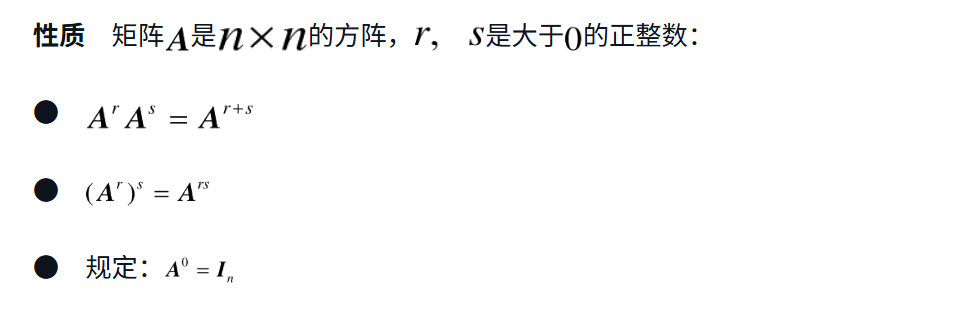


性质　初等行（列）变换相当于左（右）乘相应的初等矩阵。如此，就将矩阵乘法和初等变换联系起来了。


### 2.2 线性映射

本节描述不同基之间的关系以及对这种关系的描述。

2.2.1　理解什么是线性

不论是在数学还是在机器学习中，“线性”这个词都不鲜见，比如现在学习的是“线性代数”，机器学习中有“线性回归”，初中我们就学习过“线性函数”，等等。但是，那些名词中的“线性”是什么意思？它们与“线性空间”中的“线性”是否同义？


2.2.2	线性映射

**线性函数（或称线性映射/线性变换）：**
设 V 和 W 是两个向量空间，一个映射 f: V → W 称为线性函数，如果对任意向量 x, y ∈ V 以及任意标量 α，有：
a. f(x + y) = f(x) + f(y)
b. f(α·x) = α·f(x)
这两个性质确保 f 保持向量加法和标量乘法的结构。


线性映射就是矩阵。


线性映射可以将向量映射到高维度。

向量在同一向量空间不同基下的映射。


有的认为线性映射是不同向量空间之间的映射，线性变换是同一向量空间内的映射；


2.2.3

矩阵就是线性映射。


2.2.4 

计算机图形学中使用齐次坐标系来兼容平移操作。

平移不是线性变换

可以构造满足平移，旋转，伸缩的仿射变换

用opencv可以操作图像。


### 2.3 矩阵的逆和转置

矩阵的逆和转置都是对矩阵自身的变换，是对矩阵就是映射的深入应用。

#### 2.3.1 逆矩阵

定义

如果方阵**A**，存在矩阵**B**

使得 **AB=BA=I**

那么  **A**和**B** 互为逆矩阵。


初等矩阵可以通过增广矩阵来求出逆矩阵。对于任何可逆矩阵都可以通过增广矩阵来求出逆矩阵。


性质（很多条，待补充）

A的逆矩阵的逆使其本身


#### 2.3.2 转置矩阵

将矩阵A的行列互换生成的矩阵，称作A的转置矩阵。记作A⊤。

向量的点积可以用矩阵的乘法和转置表示。

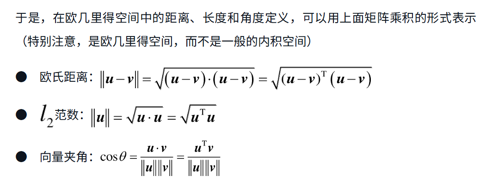


性质

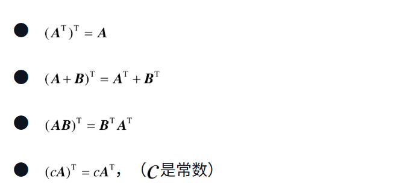


方阵A的转置矩阵是其本身，那么A是对称矩阵。


#### 2.3.3 矩阵的LU分解

解线性方程组的方法：对方程组的增广矩阵（系数矩阵和y矩阵）作初等线性变换。

得到的系数矩阵是阶梯型矩阵，进一步可能是上三角矩阵（主对角线以下的系数都是0）。

因为系数矩阵的主元都不等于零，所以可知此线性方程组有唯一解，且系数矩阵是可逆矩阵。


矩阵A分解为PLU形式，P是转置矩阵，L是下三角单位矩阵，U是上三角矩阵。矩阵能够施行LU分解的必备条件是主对角线上的第一个元素不能为零，如果仍然分解，就要先施行行变换P转置。

这样 Ax=y ，可以写为LUx=y,分解为 Lz=y  Ux=z,先求解z，再求解x。


### 2.4 行列式

#### 2.4.1 行列式计算方法和意义

定义

（数值）行列式是由一些按照某种方式排列的**方阵**所确定的一个**数**。可应用在线性方程组中，计算时使用n阶行列式计算公式。


（几何意义）行列式表征矩阵中**线性无关**的列向量在空间围成的多面体的体积（如果是二维空间，则退化为平面面积）。


性质

- 矩阵列向量线性无关 行列式不为0

- 矩阵列向量线性相关 行列式为0

- 在2.2.3节曾提到“矩阵就是映射”，下面就从映射的角度理解行列式的意义。行列式表征映射前后体积的缩放倍数。

- 奇异矩阵是线性代数中的一个重要概念，指的是**行列式值为零的方阵**。这意味着矩阵的秩不是满秩，无法表示为一个可逆矩阵。

- 奇异矩阵的性质

  1. 奇异矩阵的线性变换无法实现一一映射，因此其解可能是无穷多解或无解。
  2. 若 ( AX = 0 )，奇异矩阵 ( A ) 会导致无穷多非零解。
  3. 若 ( AX = b )，奇异矩阵可能无解或有无穷多解[1](https://blog.csdn.net/u011754972/article/details/122100701)[2](https://blog.csdn.net/AII_IIA/article/details/111518194)。

  非奇异矩阵的对比

  非奇异矩阵的行列式不为零，且其线性变换是可逆的。对于非奇异矩阵：

  1. ( AX = 0 ) 仅有唯一零解。
  2. ( AX = b ) 有且仅有唯一解。
  3. 非奇异矩阵等价于可逆矩阵[2](https://blog.csdn.net/AII_IIA/article/details/111518194)

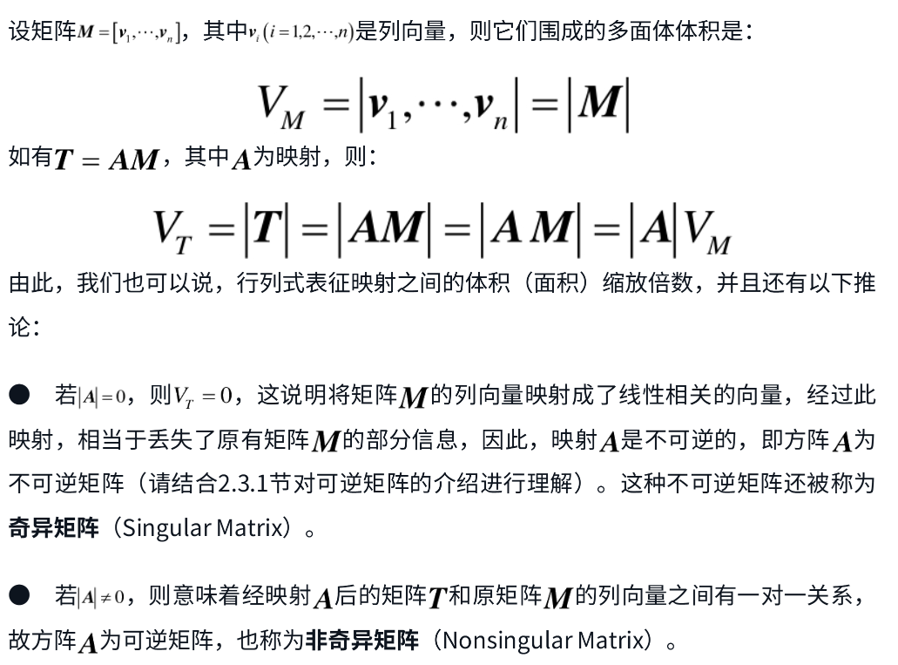

计算性质

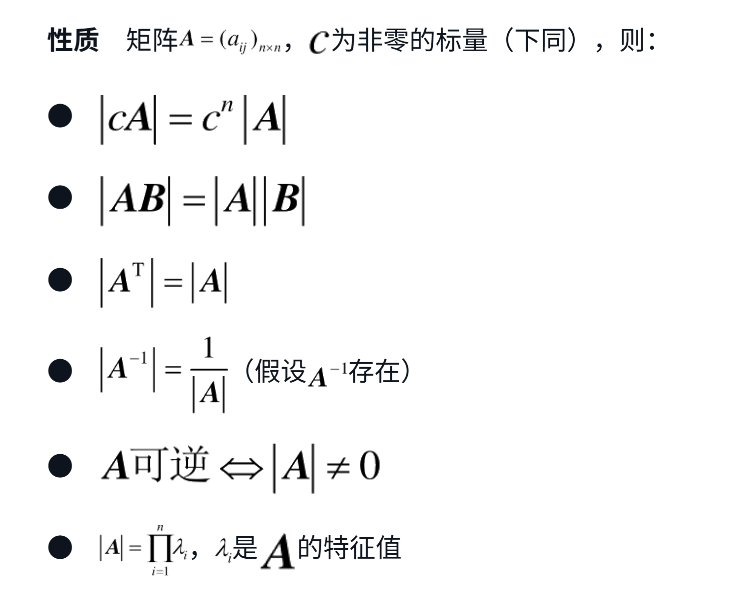


行列式是莱布尼兹用来判断n元一次方程组是否有解的方式。


在历史上，行列式的作用就在于解线性方程组，那么，也有必要对线性方程组及其求解方法有所了解，为将来探讨线性回归问题奠定基础。


判断一个线性方程组是否有解，就是判断y值是否在线性映射的值域（也是空间）中。

某个线性变化，将一个三维平面映射到二位线段，那么这个线性映射不能逆回去了，没有了唯一解。


2.4.2 解线性方程组

线性方程组一般解法：

1.将系数矩阵和等号右边的输出向量合并到一起，称作增广矩阵。

2.将增广矩阵进行一系列线性变换使得稀疏矩阵变为阶梯矩阵（为什么不叫上三角矩阵）。这个过程叫高斯消元法。

3.此时得到的线性方程组有和原线性方程组相同的解，且容易得出结果。


**判断方程是否有解**

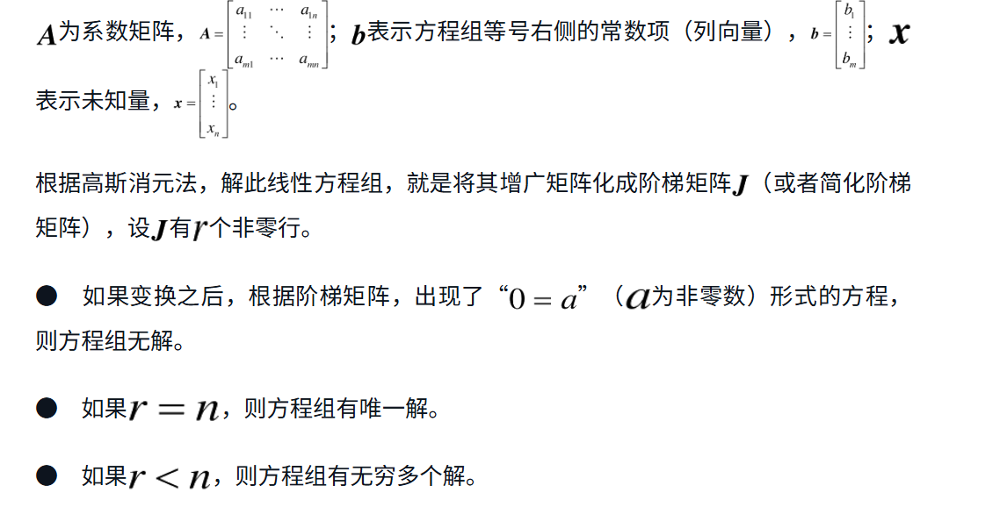

脱肛，完全映射，空间坍缩

**齐次线性方程组**

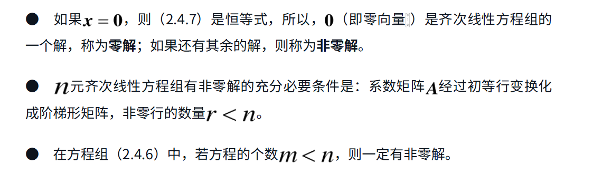

如果非零行=n ，只有零解，如果r<n,空间坍缩。

**未知量和方程个数相同**

用行列式来判断方程解的形式

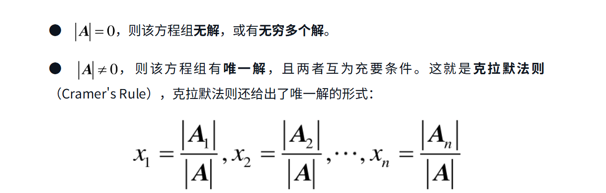

**未知量和方程个数相同的齐次线性方程组**

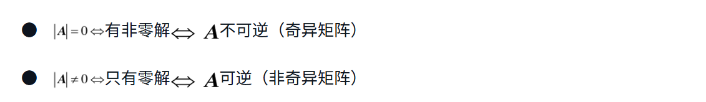

齐次线性方程组的解的性质取决于稀疏矩阵的秩和所考虑的域

在无限域中齐次方程组的解集形成一个向量子空间（称作零空间或核空间），如果秩等于n有唯一零解，如果秩小于n解集是无限的。d=n-rank(A)


### 2.5 矩阵的秩

```
矩阵的秩<= min(m,n)<n(未知数的个数) 

m>=n时 ，d可能为0或正数（取决于秩是否等于n）
```


各式各样的矩阵都有本源的阶层，这个阶层用秩来描述。


**矩阵的定义**

矩阵的列向量生成的子空间维数称为矩阵的列秩；

矩阵的行向量生成的子空间维数称为矩阵的行秩。

对于任何矩阵，列秩等于行秩，统称为矩阵的秩（rank）。


结合 1.3.3 向量组，极大线性无关组，基，维数等概念。

矩阵=向量组

矩阵的秩=向量组的秩=极大线性无关组的向量个数=基的向量个数=空间的维数

1.3.3有提到向量组的秩，同理矩阵的秩就是将矩阵看作向量组，找向量组中极大线性无关组的个数。矩阵的列秩是找列向量组的极大线性无关组，行秩是找行向量组的极大线性无关组。

由1.3.3节空间的维数可知，要根据向量组确定所生成空间的维数，必须找出极大线性无关组作为基，其中极大线性无关组中向量的个数就是该空间的维数，从而就得到了这里所说的矩阵的秩。


**确定矩阵或向量组的秩**

在找矩阵的秩，也就是找极大线性无关组时，通过初等行变换，获得阶梯矩阵。观察阶梯矩阵的非零行个数，这个数字就是矩阵的行秩；或者主元所在列构成的列向量组成了一个极大线性无关组，通过它能够知道矩阵的列秩。

性质●　阶梯形矩阵的秩等于非零行的个数，且主元所在的列构成了列向量组的一个极大线性无关组。●　矩阵的初等行变换不改变矩阵的列向量组的线性无关性，从而不改变矩阵的列秩。


定义　如果n阶矩阵的秩等于n，则称此矩阵是满秩矩阵。


此，我们已经认识到，矩阵的秩代表了矩阵的列（行）空间的维数。前面已经多次提到，矩阵就是映射。如果用矩阵乘以某个向量，就相当于把该向量映射到矩阵的列空间，即所得向量的维度就是此映射矩阵的秩。


可逆矩阵的等效表述。满秩的矩阵，本身就是极大线性无关组，没有线性相关，就不会有坍缩。

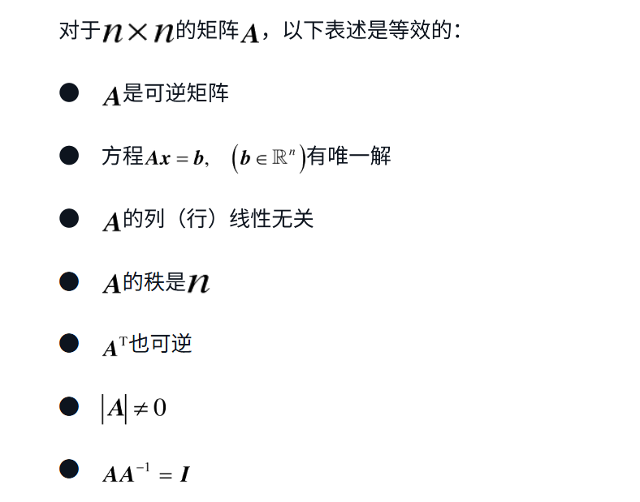

### 稀疏矩阵

矩阵的一种表示方式，是因为在机器学习和深度学习中比较常见。

2.6.1

在nlp问题中，生成词库后，词库内的向量往往0元素占了大多数。

这里所得到的矩阵，其大部分元素为零，称这种矩阵为稀疏矩阵（Spares Matrix）。

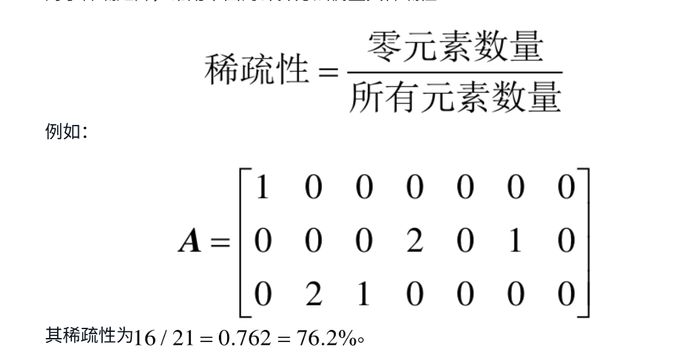

2.6.2 稀疏矩阵压缩

修改矩阵的表示形式，只记录非零元素及其位置，没有记录的位置对应的都是零元素，这就是矩阵压缩。


定义　矩阵压缩的基本原则：●　不重复存储相同元素●　不存储零元素


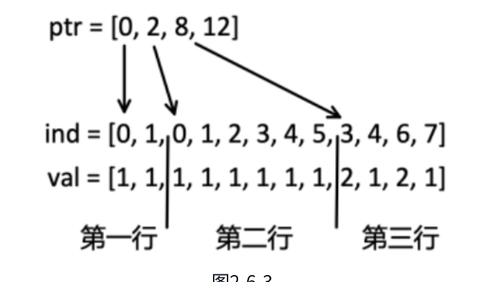

2.7 图与矩阵

2.7.1　图的基本概念

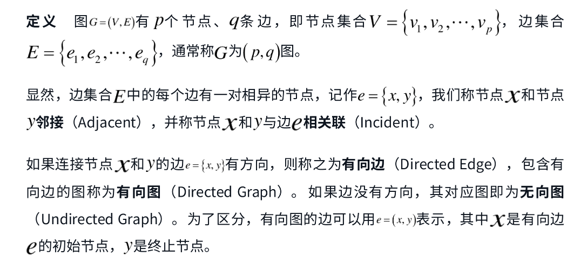


通过以下规则，生成邻接矩阵：

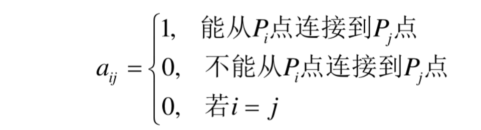

一个点可以到另一个点则称这两个节点是连通的（Connected）。若连通的节点之间没有重复节点，那么就称之为一条路径（Path）。


计算A2，A3可以得到路径长为2，为3 的邻接矩阵。


2.7.3 关联矩阵

每一行表示一个节点，每一列表示一条边。如果边“进入”节点，则矩阵对应元素为1；若边“离开”节点，则矩阵对应元素为-1；若边与节点无关，则矩阵对应元素为0。


2.7.4　拉普拉斯矩阵

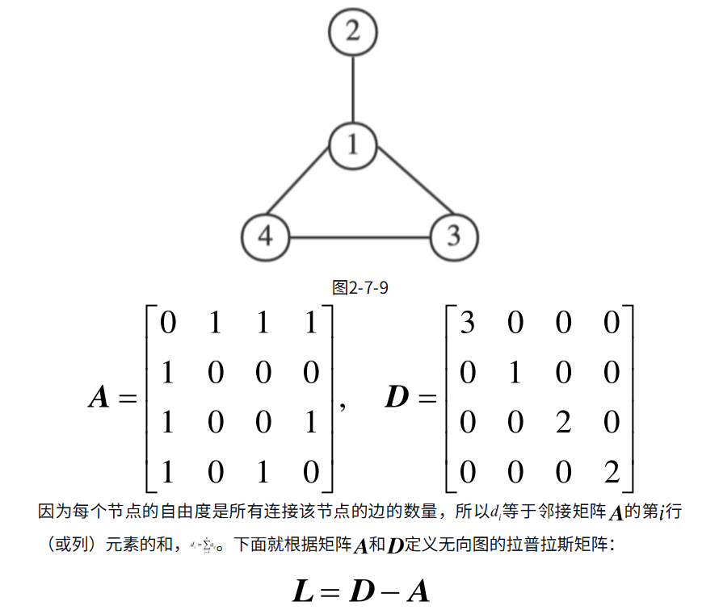


