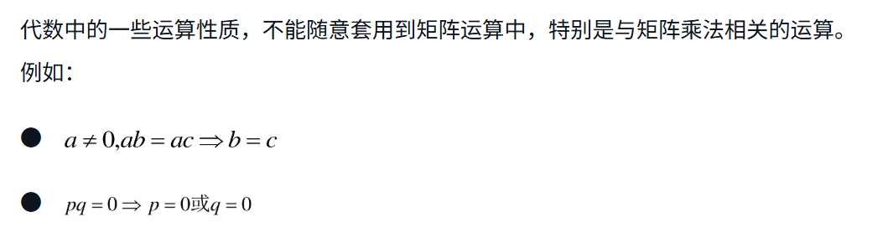

## 第二章 矩阵

2.1 矩阵基础

2.1.1 什么是矩阵 matrix

定义

由 m × n 个元素，按次序排列形成的矩形列阵，称为m × n矩阵。

向量：矩阵中的每一行，每一列称作向量，向量是一种特殊的矩阵。

方阵：m = n 时，矩阵称作方阵。

单位矩阵：　单位矩阵是方阵；●　数字1都在方阵的对角线；●　除了对角线上的1之外，其他位置的数字都是0；●将每一列（行）看作一个列（行）向量，各个列（行）向量线性无关；●　单位矩阵的列（行）向量是相应维度的线性空间的一个标准基；●　在欧几里得空间，每个列（行）向量的长度都是1；

零矩阵：所有元素都为0的矩阵。

对角矩阵：对于n阶方阵，位置索引值i=j的那些元素，构成了矩阵的主对角线（Main Diagonal），即这些从左上角到右下角的元素。如果方阵中除主对角线的元素之外，其他元素都是0。这样的矩阵称作对角矩阵。

对称矩阵：以主对角线为对称轴，两侧元素对称分布的对角矩阵，也是方阵。

2.1.2 初等变换

　互换两行（列）

●　用一个非零数乘以一行（列）

●　一行（列）的k倍加到另一行（列）

阶梯型矩阵

●　零行（即元素都是0的行，如果有的话）在矩阵的最下方；●　每个非零行的第一个元素，称为这个矩阵的主元（pivot），主元位置下方的元素都是0。

简化阶梯型矩阵

●　主元都是1；●　每个主元所在的列的其余元素都是0，

单位矩阵经过一次初等变换而得到的矩阵，称为初等矩阵（Elementary Matrix）。

2.1.3 矩阵加法

两个矩阵能够相加的前提是它们具有相同的形状，否则不能相加。对应元素相加，可以看成向量相加。

2.1.4 数量乘法

数字和矩阵每个元素相乘。

●　两个矩阵的相加符合加法封闭原则；●　如果用一个标量[插图]乘以矩阵，则此计算结果仍然是与原矩阵形状一样的矩阵，遵从乘法封闭的原则。

由此，可以说m×n的矩阵集合M是线性空间，其中的每个矩阵都是元素。

一个矩阵也可以用其他矩阵的线性组合表示。

矩阵也可以由几个矩阵生成子空间。

2.1.5 矩阵的乘法

前者的列数和后者的行数相等，就可以进行矩阵乘法。结果保留前者的行数，后者的列数。

不满足交换律

满足结合律

满足分配律

满足单位矩阵。

性质　初等行（列）变换相当于左（右）乘相应的初等矩阵。如此，就将矩阵乘法和初等变换联系起来了。

### 2.2 线性映射

本节描述不同基之间的关系以及对这种关系的描述。

2.2.1　理解什么是线性

不论是在数学还是在机器学习中，“线性”这个词都不鲜见，比如现在学习的是“线性代数”，机器学习中有“线性回归”，初中我们就学习过“线性函数”，等等。但是，那些名词中的“线性”是什么意思？它们与“线性空间”中的“线性”是否同义？

2.2.2	线性映射

**线性函数（或称线性映射/线性变换）：**
设 V 和 W 是两个向量空间，一个映射 f: V → W 称为线性函数，如果对任意向量 x, y ∈ V 以及任意标量 α，有：
a. f(x + y) = f(x) + f(y)
b. f(α·x) = α·f(x)
这两个性质确保 f 保持向量加法和标量乘法的结构。

线性映射就是矩阵。

线性映射可以将向量映射到高维度。

向量在同一向量空间不同基下的映射。

有的认为线性映射是不同向量空间之间的映射，线性变换是同一向量空间内的映射；

2.2.3

矩阵就是线性映射。

2.2.4 

计算机图形学中使用齐次坐标系来兼容平移操作。

平移不是线性变换

可以构造满足平移，旋转，伸缩的仿射变换

用opencv可以操作图像。

### 2.3 矩阵的逆和转置

矩阵的逆和转置都是对矩阵自身的变换，是对矩阵就是映射的深入应用。

#### 2.3.1 逆矩阵

定义

如果方阵**A**，存在矩阵**B**

使得 **AB=BA=I**

那么  **A**和**B** 互为逆矩阵。

初等矩阵可以通过增广矩阵来求出逆矩阵。对于任何可逆矩阵都可以通过增广矩阵来求出逆矩阵。

性质（很多条，待补充）

A的逆矩阵的逆使其本身

#### 2.3.2 转置矩阵

将矩阵A的行列互换生成的矩阵，称作A的转置矩阵。记作A⊤。

向量的点积可以用矩阵的乘法和转置表示。

性质

方阵A的转置矩阵是其本身，那么A是对称矩阵。

#### 2.3.3 矩阵的LU分解

解线性方程组的方法：对方程组的增广矩阵（系数矩阵和y矩阵）作初等线性变换。

得到的系数矩阵是阶梯型矩阵，进一步可能是上三角矩阵（主对角线以下的系数都是0）。

因为系数矩阵的主元都不等于零，所以可知此线性方程组有唯一解，且系数矩阵是可逆矩阵。

矩阵A分解为PLU形式，P是转置矩阵，L是下三角单位矩阵，U是上三角矩阵。矩阵能够施行LU分解的必备条件是主对角线上的第一个元素不能为零，如果仍然分解，就要先施行行变换P转置。

这样 Ax=y ，可以写为LUx=y,分解为 Lz=y  Ux=z,先求解z，再求解x。

### 2.4 行列式

2.4.1 行列式计算方法和意义

行列式是莱布尼兹用来判断n元一次方程组是否有解的方式。

判断一个线性方程组是否有解，就是判断y值是否在线性映射的值域（也是空间）中。

某个线性变化，将一个三维平面映射到二位线段，那么这个线性映射不能你回去了，没有了唯一解。

